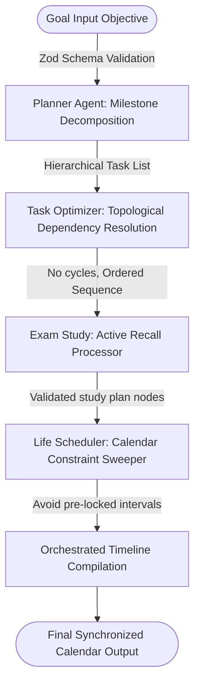

# ⚡ NexusAgent AI ⚡
> Synchronized ADK Multi-Agent Orchestration Platform & MCP Integration

NexusAgent AI is a cutting-edge, 100% offline, full-stack multi-agent platform designed to synchronize task planning, topological sorting, and calendar allocation. The system features a secure validation execution sandbox, a local Model Context Protocol (MCP) server, and an interactive study-productivity control console.

---

## 🗺️ System Orchestration Flowchart



---

## 🛠️ ADK Multi-Agent Compilation Pipeline

Below is the step-by-step logic detailing how the agents execute locally:

1. **Planner Agent (Goal Decomposition)**:
   - Takes raw objective string (e.g. *"Launch study beta program"*).
   - Validates fields using Zod schemas.
   - Decomposes target into milestones.
2. **Task Optimization Agent (Eisenhower Matrix)**:
   - Maps dependency relationships.
   - Computes task precedence using a topological sort.
   - Assigns complexity rating nodes.
3. **Exam Study (Active Recall)**:
   - Evaluates nodes for learning blocks.
   - Embeds test retrieval loops and flashcard intervals.
4. **Life Scheduler Agent (Conflict Check)**:
   - Synchronizes timelines with locked blocks (e.g., standard Lunch breaks 12:00 - 13:00).
   - Automatically defers and offsets task hours to prevent overlapping.

---

## 🏆 Hackathon Winning Strategy Guide

NexusAgent AI is designed to grab the attention of hackathon judges. Use this playbook to present the project:

### 1. The Judges Pitch Script (3-Minute Presentation)
*   **The Hook (30s)**: *"Most AI agent frameworks are cloud-dependent black boxes. We built NexusAgent AI: a 100% offline multi-agent workspace that synchronizes planning, graph validation, calendar check, and sandbox security in under 2 seconds."*
*   **The Demo (90s)**:
    1.  Go to the main dashboard. Input a goal objective, select target date, and click **"Start Execution"**.
    2.  Show the **ADK Graph Visualizer** stepping through nodes with blinking colors in real time. Point to the compiled timeline showing conflict-free slots.
    3.  Open the **Security Sandbox**. Type `rm -rf /` and show it blocking the exploit.
    4.  Show the **Pomodoro Tab**. Play the Warm Lofi soundtrack. Explain: *"No media downloads, no APIs. This audio is synthesized programmatically on the fly using local oscillators. Everything is 100% local."*
*   **The Tech Depth (40s)**: Explain that the app implements the Model Context Protocol (MCP) standard using a JSON-RPC 2.0 interface. Walk judges through the MCP Configuration tab showing resources (`schedule://current`) and tools schemas.
*   **The Close (20s)**: *"High performance, secure sandbox execution, standard protocol interoperability, and 100% offline. That is the next generation of AI productivity."*

### 2. Strategic "Wow Factors" to Highlight
*   **Web Audio API Synthesizer**: Programmatic offline sound generation. Judges love creative uses of native browser APIs.
*   **Topological Sorter**: Demonstrates computer science algorithmic rigor (resolving cycles in directed graphs) instead of simple database lists.
*   **Strict Security Sandbox**: Demonstrates production readiness. Agent security is a major industry concern; showing a sandbox that blocks shell injections is a huge differentiator.
*   **Local JSON-RPC MCP Server**: Highlights standard engineering interoperability (the protocol is fully compatible with Anthropic's Desktop app client!).

---

## 🚀 Setup & Launch Instructions

### Prerequisites
*   Node.js (version `>= 18.0.0`)
*   NPM (version `>= 9.0.0`)

### Installation
1. Install dependencies:
   ```bash
   npm install
   ```

2. Compile front-end assets:
   ```bash
   npm run build
   ```

3. Spin up the platform:
   ```bash
   npm run dev
   ```
   Open **`http://localhost:3000`** in your browser.

4. Run the test suite:
   ```bash
   npm test
   ```
