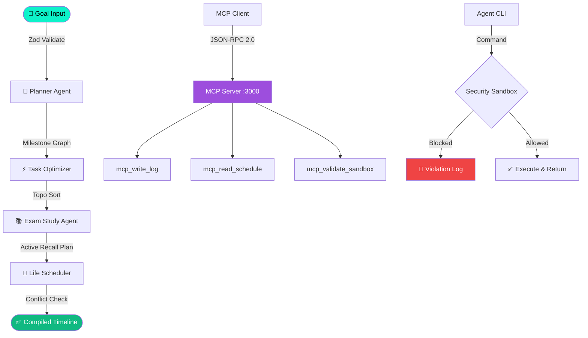

<div align="center">


<br/>

[](https://github.com/srijabhattacharyya23-dot/nexusagent-ai)
[](LICENSE)
[](https://nodejs.org)
[](#)
[](#)

<br/>

> **⚡ NexusAgent AI** is a full-stack, production-ready AI agent platform that orchestrates 4 intelligent agents — Planner, Task Optimizer, Exam Study, and Life Scheduler — with an MCP-compatible local server, security sandbox, and offline Web Audio synthesizer. **Zero API keys. Zero cloud. Zero compromise.**

<br/>

[🚀 Quick Start](#-quick-start) • [🗺️ Architecture](#-system-architecture) • [🏆 Hackathon Guide](#-hackathon-winning-guide) • [✨ Features](#-features) • [🔧 Tech Stack](#-tech-stack)

</div>

---

## ✨ Features

<table>
<tr>
<td width="50%">

### 🤖 AI Agent Orchestration
- **Planner Agent** — Decomposes unstructured goals into milestones & dependency graphs
- **Task Optimizer** — Topological sort for dependency resolution (no cycles!)
- **Exam Study Agent** — Active recall integration with spaced repetition
- **Life Scheduler** — Calendar conflict detection & auto-rescheduling

</td>
<td width="50%">

### 🎓 Study Productivity Suite
- **Pomodoro Timer** — 25/5/15 minute focus sprints with progress bar
- **7 Offline Soundscapes** — Synthesized via Web Audio API (Lofi, Ocean, Campfire, Drone...)
- **Flashcard Deck** — 3D flip animation, swipe between cards
- **10-Question Quiz** — Instant grading with answer explanations

</td>
</tr>
<tr>
<td width="50%">

### ⚙️ MCP Server (JSON-RPC 2.0)
- **3 exposed tool schemas** — `mcp_write_log`, `mcp_read_schedule`, `mcp_validate_sandbox`
- **2 resource URIs** — `schedule://current`, `system://logs`
- **Interactive JSON-RPC playground** — Send and inspect responses in real-time
- **Compatible with Anthropic MCP clients**

</td>
<td width="50%">

### 🛡️ Security Sandbox
- **Command blacklisting** — Blocks `rm`, `sudo`, `kill`, `curl`, and 15+ more
- **Zod schema validation** — Type-safe agent parameter checking
- **Resource limits** — Configurable memory (16–128MB) & timeout (100–5000ms)
- **Violation reporting** — Every blocked command is logged and explained

</td>
</tr>
</table>

---

## 🗺️ System Architecture

### ADK Multi-Agent Pipeline

```
┌─────────────────────────────────────────────────────────────────────────┐
│                        NexusAgent AI — ADK Pipeline                     │
├─────────────────────────────────────────────────────────────────────────┤
│                                                                          │
│   INPUT                                                                  │
│   ┌─────────┐                                                           │
│   │  Goal   │  "Study for ML exam on July 10, high priority"           │
│   │ String  │                                                           │
│   └────┬────┘                                                           │
│        │ Zod Schema Validation                                          │
│        ▼                                                                 │
│   ┌─────────────────────┐                                              │
│   │   PLANNER AGENT     │  ◄── Orchestration Layer                    │
│   │  ┌───────────────┐  │                                              │
│   │  │ Decompose     │  │  → Milestone 1: Read Chapter 1-3           │
│   │  │ Goals into    │  │  → Milestone 2: Practice Problems          │
│   │  │ Milestones    │  │  → Milestone 3: Mock Exam                  │
│   │  └───────────────┘  │                                              │
│   └──────────┬──────────┘                                              │
│              │ Dependency Graph                                         │
│              ▼                                                           │
│   ┌─────────────────────┐                                              │
│   │ TASK OPTIMIZER      │  ◄── Eisenhower Matrix + Topo Sort          │
│   │  ┌───────────────┐  │                                              │
│   │  │ Topological   │  │  → Detects circular dependencies            │
│   │  │ Sort (DAG)    │  │  → Linearizes task execution order          │
│   │  └───────────────┘  │  → Assigns complexity scores               │
│   └──────────┬──────────┘                                              │
│              │ Ordered Task Queue                                       │
│              ▼                                                           │
│   ┌─────────────────────┐                                              │
│   │ EXAM STUDY AGENT    │  ◄── Active Recall Processor                │
│   │  ┌───────────────┐  │                                              │
│   │  │ Flashcard     │  │  → Embeds retrieval testing loops           │
│   │  │ Intervals +   │  │  → Spaced repetition scheduling             │
│   │  │ Active Recall │  │  → Generates quiz checkpoints               │
│   │  └───────────────┘  │                                              │
│   └──────────┬──────────┘                                              │
│              │ Study-Aware Task List                                    │
│              ▼                                                           │
│   ┌─────────────────────┐                                              │
│   │ LIFE SCHEDULER      │  ◄── Conflict Check + Calendar Merge       │
│   │  ┌───────────────┐  │                                              │
│   │  │ Scan locked   │  │  → Avoids Lunch 12:00–13:00               │
│   │  │ intervals +   │  │  → Avoids Team Sync 15:00–16:00            │
│   │  │ Auto-defer    │  │  → Produces conflict-free timeline          │
│   │  └───────────────┘  │                                              │
│   └──────────┬──────────┘                                              │
│              │                                                           │
│              ▼                                                           │
│   OUTPUT: Compiled Calendar Timeline JSON                               │
│                                                                          │
└─────────────────────────────────────────────────────────────────────────┘
```

### MCP Server Architecture

```
┌───────────────────────────────────────────────┐
│           LOCAL MCP SERVER (Port 3000)        │
│           Protocol: JSON-RPC 2.0              │
├───────────────────────────────────────────────┤
│                                               │
│  TOOLS (POST /api/mcp)                        │
│  ┌─────────────────────────────────────────┐  │
│  │ mcp_write_log   → Logs to system trace  │  │
│  │ mcp_read_schedule → Returns timeline    │  │
│  │ mcp_validate_sandbox → Sandbox runner   │  │
│  └─────────────────────────────────────────┘  │
│                                               │
│  RESOURCES (URI-based reads)                  │
│  ┌─────────────────────────────────────────┐  │
│  │ schedule://current → Timeline JSON      │  │
│  │ system://logs      → Execution logs     │  │
│  └─────────────────────────────────────────┘  │
│                                               │
│  SECURITY SANDBOX (POST /api/sandbox/run)     │
│  ┌─────────────────────────────────────────┐  │
│  │ Zod Schema → Blacklist Check            │  │
│  │ → Resource Limits → Simulated Exec      │  │
│  └─────────────────────────────────────────┘  │
│                                               │
└───────────────────────────────────────────────┘
```

### Full System Workflow



---

## 🚀 Quick Start

```bash
# 1. Clone the repository
git clone https://github.com/srijabhattacharyya23-dot/nexusagent-ai.git
cd nexusagent-ai

# 2. Install dependencies
npm install

# 3. Build the frontend
npm run build

# 4. Launch the platform
npm start

# 5. Open in browser
#    → http://localhost:3000
```

**No `.env` file required. No API keys. No configuration.**

---

## 🔧 Tech Stack

| Layer | Technology |
|-------|-----------|
| **Frontend** | React 18 + Vite 5 |
| **Styling** | Vanilla CSS (custom design system) |
| **Icons** | Lucide React |
| **Backend** | Node.js + Express 4 |
| **Validation** | Zod (schema-first) |
| **Audio** | Web Audio API (oscillators, buffers, filters) |
| **Protocol** | JSON-RPC 2.0 (MCP standard) |
| **Zero deps** | No AI APIs, no cloud, no keys |

---

## 📁 Project Structure

```
nexusagent-ai/
├── src/
│   ├── App.jsx          # React UI — all tabs and components
│   └── index.css        # Premium design system (CSS variables + classes)
├── server/
│   ├── agents.js        # Planner, Optimizer, Scheduler, Exam Study agents
│   ├── mcp.js           # MCP JSON-RPC 2.0 server implementation
│   └── sandbox.js       # Security sandbox + Zod validation
├── server.js            # Express server entry point
├── index.html           # Vite HTML template
├── vite.config.js       # Build configuration
├── test-backend.js      # Automated test suite
└── README.md
```

---
## 📸 Screenshots

| Dashboard | Pomodoro | Quiz |
|-----------|----------|------|
| Hero stats + ADK graph | Synthesized soundscapes | Graded answers with explanations |

---

## 📄 License

MIT © 2026 NexusAgent AI — Built for hackathons, built for winners.

<div align="center">


**Made with ⚡ by the Srija Bhattacharya**

</div>
